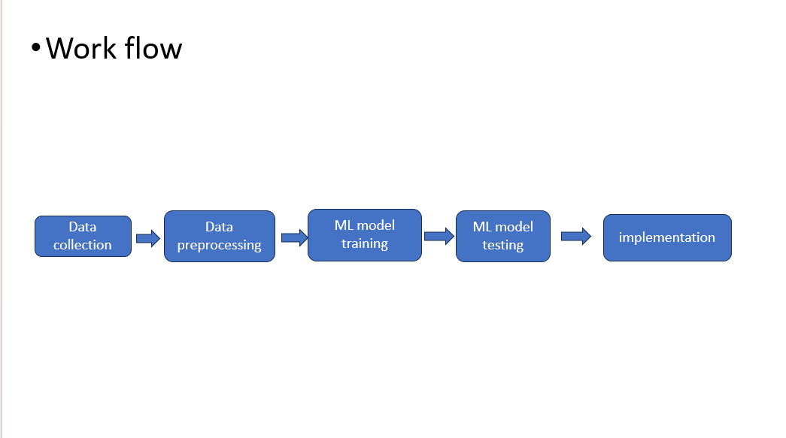

<h1 align="center" style="border-bottom: none">
    <b>
        <a href="https://www.google.com"> Crop Recommendation system </a> 
    </b>
    ⭐️ Harvesting Goodness,Naturally ⭐️  
</h1>

# [`Code link`](https://colab.research.google.com/github/Piro5121/CROP-RECOMMENDATION-SYSTEM-/blob/main/Crop_Classification_With_Recommendation_System.ipynb)  [`Demo video link `](https://drive.google.com/file/d/1-m15MIyTKTvfOh6siFXdFwrWh99FOnU1/view?usp=drive_link) [`Git Hub links `](https://github.com/balu018/crop_recommendation.git) 
Our project aim is to help the farmers who are illiterate, meaning who don't know about what crop to cultivate based on PH value,Temperature, rainfall and other basic values.our project will also be usefull for all farmers regardless,who are hesitating about the type of crop to cultivate.  
## Team Details
`Team number` : VH170

| Name    | Email           |
|---------|-----------------|
| J.Vamshi Krishna | 99210042140@klu.ac.in |
| K.Balaraju | 99210041674@klu.ac.in |
| Y.V.Harinadh Reddy | 99210042016@klu.ac.in |
| T.Gangadhar | 9921004720@klu.ac.in |

## Problem statement 
Many farmers who don't know about what type of crop to cultivate based on basic factors,In the future they will suffer by not getting the crop production which leads to many problems,we need to address this problem to improve the way of farming. 
## About the project
our project helps the farmers to increase the yields which will lead to motivate the farmers using the given factors , by cultvating the crop we recommended the risk of the yield going waste will be gradually decreased.

## Technical implemntaion 
mention the approach and how you have solved the problem with the technology , utilize multiple flowcharts to explain your solutions and approach
- use bullets to explain
- be consise and specific
- explain with images and flowcharts
- 
![flowchart]
output:

## Techstacks used 
`html` , `css` , `ml` , `javascript`

## How to run locally 
explain detailed steps to run your project locally , example to run a react application 
- step 1 : clone the repo 
- step 2 : change the directory to project directory 
- step 3 : install  libraries like pandas numpy flask_cors matplotlib scikit-learn in the terminal using thecommand
- pip install pandas numpy flask_cors matplotlib scikit-learn
- step 4 : run python app.py  in the terminal
- step 5 : open localhost in browser

# What's next ?
our future plan for the project is to improve the existing one and further will be proceeded by the mistakes from this one. 

## Declaration
We confirm that the project showcased here was either developed entirely during the hackathon or underwent significant updates within the hackathon timeframe. We understand that if any plagiarism from online sources is detected, our project will be disqualified, and our participation in the hackathon will be revoked.
